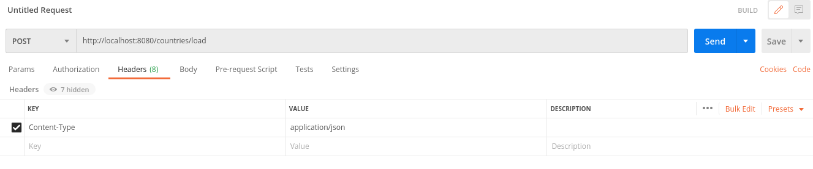
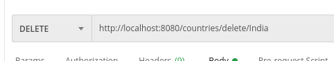

# REST-API-using-Springboot

- clone the code
- open in VS code
- VS code might ask whether you trust mvn Wrapper. So please choose yes
- click on Run

It will run at port 8080

Intstall postman and open it

# Load data to DB
  set content type
  
  send data in body
  
  
# Get data
  
  
# Delete
  
  
# Update
  

## Useful resources

- https://www.studytonight.com/rest-web-service/
- https://github.com/TechPrimers/learning-path-spring-boot-microservices

## Points to remember

- Resources: /flowers/,  /countries/, /users, /students
- Resources are always plural nouns
- Actions are always described by the HTTP methods which are verbs. Example: PUT, GET, POST, DELETE ...
- Any method can be used to implement any action, but following conventions is a preofessional coder hobby

