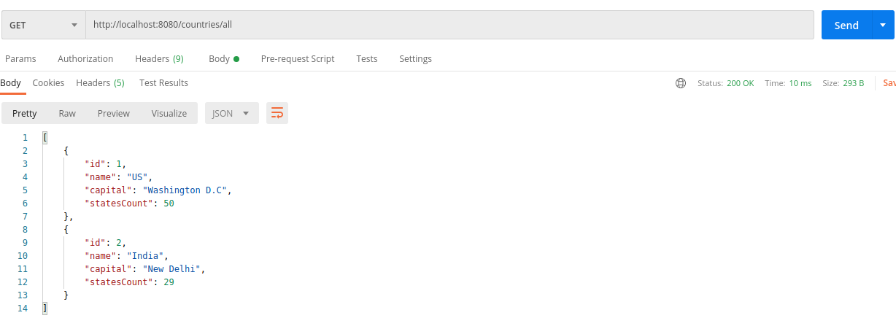
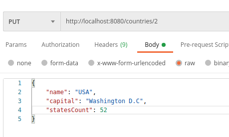

# REST-API-using-Springboot

clone the code,
open in VS code,
click on Run

It will run at port 8080

Intstall postman and open it

# Load data to DB
  set content type
  
  send data in body
  
  
# Get data
  
  
# Delete
  
  
# Update
  
