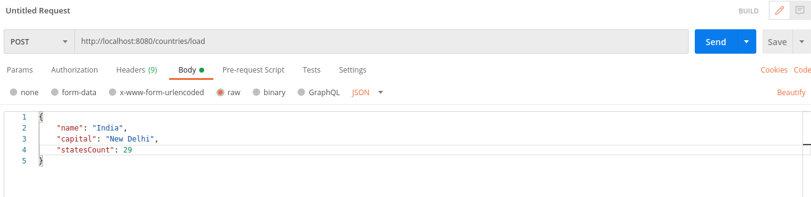

# REST-API-using-Springboot

- clone the code
- open in VS code
- VS code might ask whether you trust mvn Wrapper. So please choose yes
- click on Run

It will run at port 8080 unless you change it in application.properties file

Intstall Postman and open it

# Load data to DB
  set content type
  
  send data in body
  
  
# Get data
  
  
# Delete
  
  
# Update
  

## Useful links

- https://www.studytonight.com/rest-web-service/
- https://github.com/TechPrimers/learning-path-spring-boot-microservices
- https://docs.oracle.com/javaee/7/api/javax/persistence/package-summary.html
- https://www.postgresql.org/download/linux/ubuntu/   postgres installation
- https://dzone.com/articles/spring-boot-and-postgresql

## Points to remember

- Resources: /flowers/,  /countries/, /users, /students
- Resources are always plural nouns
- Actions are always described by the HTTP methods which are verbs. Example: PUT, GET, POST, DELETE ...
- Any method can be used to implement any action, but following conventions is a professional coder hobby

